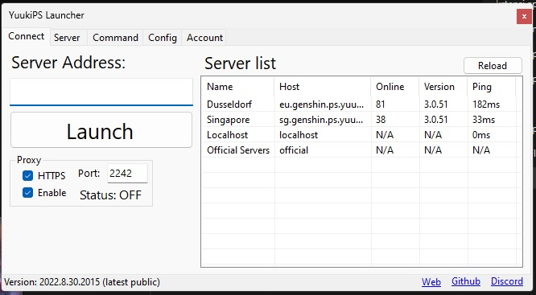

## YuukiPS Launcher
A simple Launcher that run several anime games.

  

### Features

* Automatic game detection (if you have an official launcher)
* Download patch & Verify game data based on current game in PS version use md5 with api server check (YuukiPS only)
* Support multi profile game.
* Auto rollback to original version so you can play official version without renaming it again.
* Local proxy support, so no need extra proxy like fiddler.
* Cheat/mods free [from third parties if any] supported with auto update.(TODO: need fix api)
* Auto update.

### Installation

For Nightly Releases [Download here](https://github.com/YuukiPS/Launcher-PC/releases)

### Screenshot

### How to use
